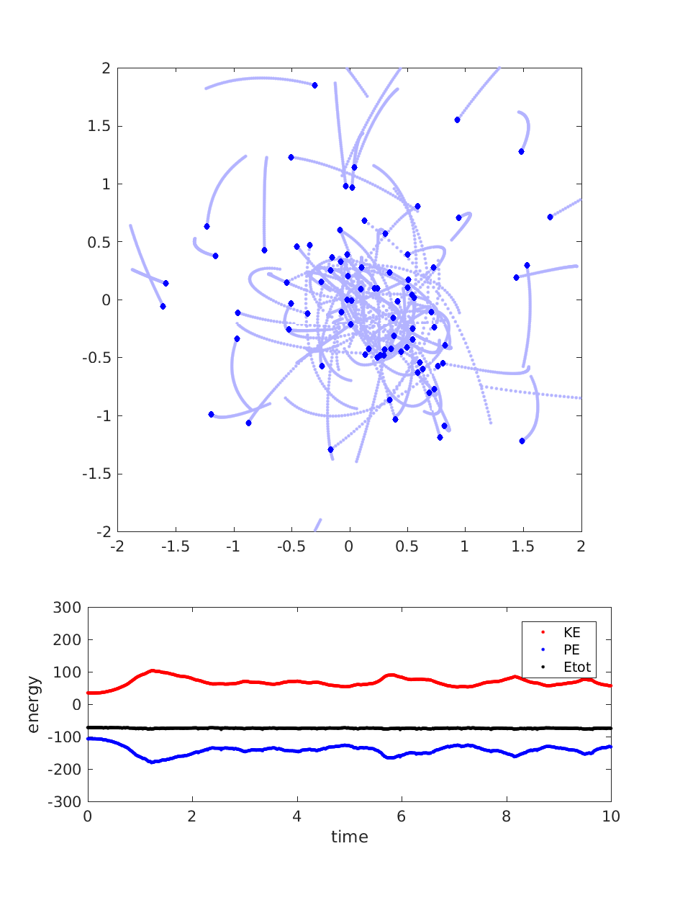

# nbody-matlab
Vectorized N-body code (Matlab)

Create Your Own N-body Simulation (With Matlab/Octave)
Philip Mocz (2020) Princeton Univeristy, [@PMocz](https://twitter.com/PMocz)

Simulate orbits of stars interacting due to gravity
Code calculates pairwise forces according to Newton's Law of Gravity

```
matlab nbody.m
```



